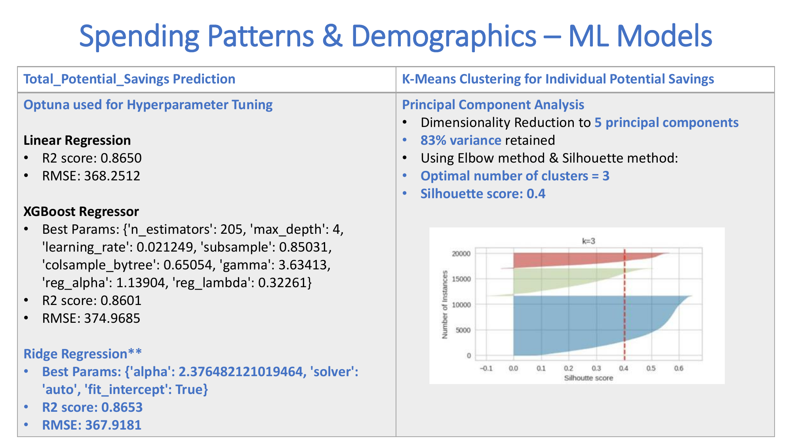
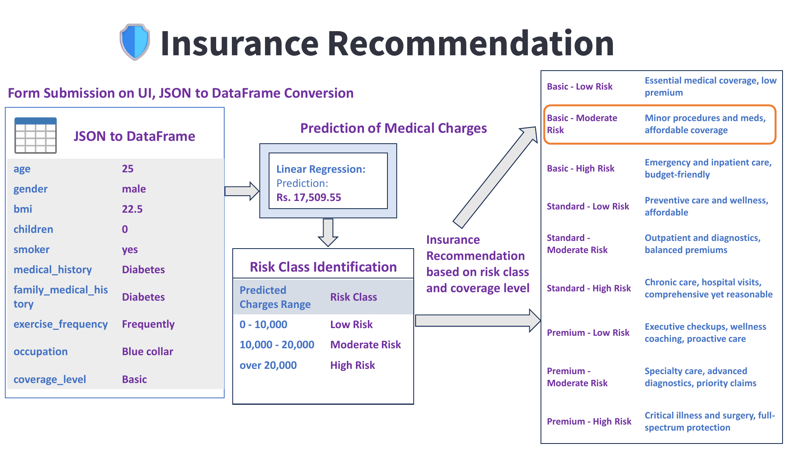
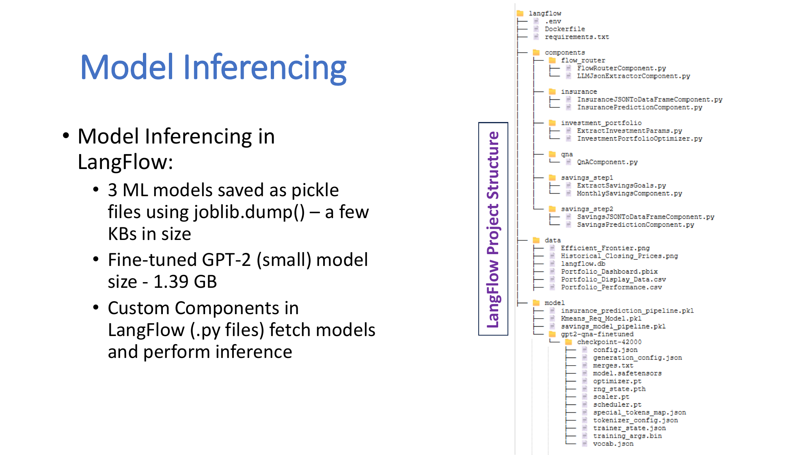

# 🤖 Finnie App — WealthKraft FinTech

Welcome to the parent repository of the **Finnie App** project.
Finnie App project offered by WealthKraft FinTech serves as a personal financial advisor for retail clients.
As part of this project, four features are being offered: 
- Savings Goals
- Insurance Recommendation
- Investment Portfolio Optimization
- Ask me Anything (QnA with Finnie)

_This project has been developed as the Capstone project for **PG Level Advanced Certification Programme in Computational Data Science offered by Indian Institute of Science (IISc)** Bangalore in association with **TalentSprint (part of Accenture)**._

This repository contains:

- 🔗 Links to the core submodules of the project
- 📊 A full presentation with slides and visuals

---

## 📁 Project Structure

| Component | Description | Link |
|----------|-------------|------|
| 🔀 `LangFlow` | LangFlow Project for user flow / journeys and integration of the models | [/wealthkraft-langflow](https://github.com/jayanti-k-88/wealthkraft-langflow) |
| 🌐 `Streamlit` | Streamlit frontend UI repository | [/wealthkraft-streamlit](https://github.com/jayanti-k-88/wealthkraft-streamlit) |
| 📈 `Investment Portfolio User Criteria - Plots & CSVs` | Portfolio optimization outputs, CSVs, and plots corresponding to user criteria | [/wealthkraft-investment-portfolio-user-criteria-plots-csvs](https://github.com/jayanti-k-88/wealthkraft-investment-portfolio-user-criteria-plots-csvs) |
| 🧪 `Colab Notebooks` | Development and Model training in Google Colab | [/wealthkraft-colab-notebooks](https://github.com/jayanti-k-88/wealthkraft-colab-notebooks) |
| ☁️ `AWS EC2 SSH Scripts` | Deployment and automation scripts for AWS EC2 | [/wealthkraft-aws-ec2-ssh-scripts](https://github.com/jayanti-k-88/wealthkraft-aws-ec2-ssh-scripts) |
| 📄 `Project Documents` | Project Proposal, Final Report, Data Story and Final Presentation Slide Deck | [/wealthkraft-documents](https://github.com/jayanti-k-88/wealthkraft-documents) |
| ▶️ `Demo Video` | Quick 5 min Demo Video for the Project | [/wealthkraft-demo](https://github.com/jayanti-k-88/wealthkraft-demo) |

---

## 🖼️ Finnie App Presentation
> The following is the original presentation with slides and data: 

